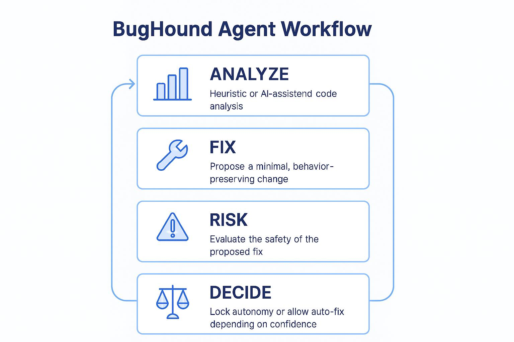

# BugHound Mini Model Card (Reflection)

# 👉 [Model Card](model_card.md) | [ReadMe](README.md) | 

# BugHound – Model Card

## 🐶 BugHound Agent Loop

---

## System Overview

**Name:** BugHound  
**Purpose:**  
BugHound analyzes short Python code snippets, proposes conservative fixes, and
evaluates the risk of those changes before deciding whether to auto‑apply them
or defer to human review.

**Intended Users:**  
Students and developers learning about agentic workflows, AI reliability,
and human‑in‑the‑loop system design.

---

## Agentic Workflow

BugHound follows a structured agent loop:

1. **Analyze**
   - Heuristic analysis runs first
   - Optional Gemini analysis is attempted if enabled

2. **Propose Fix**
   - Uses conservative heuristic fixes
   - Preserves original behavior when possible

3. **Assess Risk**
   - Evaluates safety signals such as:
     - Code modification
     - AI involvement
     - Disagreement between AI and heuristics

4. **Decide or Defer**
   - Auto‑fix only when risk is low
   - Lock autonomy when confidence is reduced

Heuristics are always available as a fallback and are preferred when uncertainty
is detected.

---

## Inputs and Outputs

**Inputs:**
- Short Python scripts or functions
- Common patterns such as conditionals, loops, and try/except blocks

**Outputs:**
- Detected issues (heuristic and AI, shown side‑by‑side)
- A proposed fixed version of the code
- A structured risk report
- A step‑by‑step agent trace

---

## Reliability and Safety Rules

1. **AI Involvement Increases Risk**
   - Any AI‑assisted change raises the risk score
   - Prevents silent over‑trust in model output

2. **AI–Heuristic Disagreement Locks Autonomy**
   - If AI findings differ from heuristics, auto‑fix is disabled
   - Forces human review when signals conflict

**Potential False Positives:**
- Benign AI suggestions triggering manual review

**Potential False Negatives:**
- Heuristic rules missing context‑specific issues

---

## Observed Failure Modes

1. **AI Over‑Interpretation**
   - AI may suggest unnecessary changes to valid code
   - Mitigated by disagreement detection and fallback

2. **Heuristic Blind Spots**
   - Simple rules may miss subtle logic errors
   - AI helps surface these but does not override safety checks

---

## Heuristic vs Gemini Comparison

- Gemini detects higher‑level issues heuristics may miss
- Heuristics provide consistency and predictability
- Gemini output is treated as advisory, not authoritative
- Risk scoring favors caution when AI is involved

---

## Human‑in‑the‑Loop Triggers

BugHound requires human review when:
- AI and heuristic analyses disagree
- The risk score exceeds the safe threshold
- The agent’s confidence is reduced

Clear trace messages explain why autonomy was locked.

---

## Proposed Improvement

Add structural diff analysis to detect control‑flow changes
(e.g., return paths or exception handling) and increase risk
when behavior changes are likely.